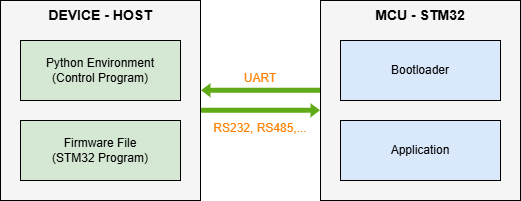

# STM32 Firmware Over-The-Air (FOTA) Update Tool

This repository provides a Python-based tool for performing Firmware Over-The-Air (FOTA) updates on STM32 microcontrollers (MCUs) via UART. The tool supports both single-core (STM32F4, STM32F7) and dual-core (STM32H7) MCUs, offering two operational modes: **Option Mode** (interactive menu) and **Sequential Mode** (command-line automation).

## Table of Contents
1. [Overview](#overview)
2. [Project Components](#project-components)
3. [Features](#features)
4. [System Architecture](#system-architecture)
   - [Block Diagram](#block-diagram)
   - [Communication Protocol](#communication-protocol)
5. [Usage Instructions](#usage-instructions)
   - [Setup (Prepare)](#1-setup-prepare)
   - [Running in Option Mode](#2-running-in-option-mode)
   - [Running in Sequential Mode](#3-running-in-sequential-mode)
   - [UART Console](#4-uart-console)
   - [Command Examples](#5-command-examples)
6. [Troubleshooting](#troubleshooting)


## Overview
This project implements a **Firmware Over-The-Air (FOTA)** system for STM32 microcontrollers, specifically targeting STM32F4, STM32F7 (single-core), and STM32H7 (dual-core). The system allows firmware updates via UART using a Python-based host application communicating with a custom bootloader on the STM32. The tool is designed to be user-friendly, with an interactive menu for manual operations and a sequential mode for automated workflows.

## Project Components
The project consists of three main components. For details, you can refer to this:

1. **[Python Scripts - Host](Bootloader_Host/HOST_DEVICE.md)**: A Python script running on the host device, responsible for selecting, transmitting, and managing firmware updates to the STM32.
2. **[STM32 Bootloader](STM32_BOOTLOADER.md)**: Software running on STM32, which handles communication and firmware updates.
3. **[Application Firmware](FIRMWARE_APPLICATION.md)**: Sample application code for STM32, demonstrating how to develop applications compatible with the bootloader.

## Features
- **Supported MCUs**: STM32F407VGTx, STM32F765VGTx (single-core), STM32H745ZITx (dual-core).
- **Operational Modes**:
  - **Option Mode**: Interactive menu for manual control of bootloader operations.
  - **Sequential Mode**: Automated firmware update process via command-line arguments.
- **Firmware Management**:
  - CRC32 verification for data integrity.
  - Write and read firmware metadata.
  - Timeout mechanism to jump to the application if no host command is received.
- **UART Console**: Interactive terminal for sending commands to the STM32 application.
- **Error Handling**: Robust validation and error reporting for user inputs and operations.

## System Architecture

### Block Diagram
The following diagram illustrates the interaction between the host and the STM32 MCU:

<div align="center">
  
</div>
<!-- [Sơ đồ khối](assets/blockdiagram.png) -->

- **Device-Host**: A device (e.g., PC or embedded system) running a Python environment, consisting of two main components: a Python control program managing the FOTA process and a firmware binary file (.bin) for programming the STM32.

- **MCU-STM32**: The target STM32 microcontroller, responsible for receiving commands from the host to update and run the application, comprising two main components: the bootloader, which handles communication and firmware updates, and the application, which is the user’s program.

### Communication Protocol
The tool communicates with the STM32 bootloader using a custom packet-based protocol over UART. Each packet includes:
- **Length**: Byte indicating the packet size (excluding the length byte).
- **Command**: Byte specifying the operation (e.g., `0x10` for Read Chip ID, `0x14` for Upload Application).
- **Data**: Command-specific data (e.g., firmware number, chunk size, version numbers).
- **CRC32**: 4-byte MPEG-2 CRC32 checksum for data integrity.

## Usage Instructions
### 1. Setup (Prepare)

1. **Flash Bootloader**:
   - Compile the bootloader code using STM32CubeIDE and flash it to both cores.
   - Or use the pre-built HEX file and flash it using STM32 ST-LINK Utility.
2. **Prepare Application Firmware**:
   - Place the `.bin` firmware files in the same directory as the Python control program, or specify the directory path.
   - Detail:
     - [For STM32H745ZITx](FIRMWARE_APPLICATION.md)
     - **For STM32F765VGTx**
     - **For STM32F407VGTx**
3. **Install Python Dependencies**:
   ```bash
   pip install -r requirements.txt
   ```
4. **Connect Hardware**:
   - Connect the STM32 to the HOST via UART.
   - Ensure the STM32 is powered.

### 2. Running in Option Mode
Run the script in interactive mode to access a menu-driven interface:
```bash
python FOTA.py -mode opt
```
**Follow the menu prompts to**:
  - **Select COM Port**: Choose from a list of available serial ports (e.g., `COMx`, `/dev/ttyUSBx`).
  - **Select MCU Type**:
     - `1`: STM32F4 or STM32F7 (single-core).
     - `2`: STM32H7 (dual-core).
  - **Menu Options**:
     - `1`: Check connection to ensure the mcu in bootloader mode.
     - `2`: Read the MCU chip ID.
     - `3`: Select core to process(1 or 2; single-core MCUs only support 1).
     - `4`: Erase flash memory for the selected core.
     - `5`: Select a `.bin` firmware file from the current directory or provide a file path.
     - `6`: Flash the selected firmware file.
     - `7`: Write firmware version (e.g., `1.0.0`).
     - `8`: Read firmware details (version, size, status).
     - `9`: Jump to the application.
     - `10`: Open a UART console for direct interaction with the application.
     - `11`: Exit the program.


**Notes**:
- Most operations require a successful connection check (option 1) first.
- The UART console (option 10) is only available after jumping to the application (option 9).

### 3. Running in Sequential Mode
Run the script in automated mode to perform a complete firmware update sequence:
```bash
python FOTA.py -mode seq -port <PORT> -mcu <MCU> [other arguments]
```

**Arguments**:
- `-mode seq`: Specifies sequential mode.
- `-port`: Serial port (e.g., `COMx`, `/dev/ttyUSBx`).
- `-mcu`: MCU type (`F4`, `F7`, or `H7`).
- `-bin`: Firmware file for single-core MCUs (STM32F407, STM32F765).
- `-bin1`, `-bin2`: Firmware files for dual-core MCU (STM32H745).
- `-v`: Version string for single-core MCU (default: `1.0.0`).
- `-v1`, `-v2`: Version strings for dual-core MCU (default: `1.0.0`).

**Notes**:
   - If `-v`, `-v1`, `-v2` argument is not given, the default version will be 1.0.0.

**Sequential Steps** (for single-core MCU):
1. Check connection to the bootloader.
2. Select core 1.
3. Erase flash memory.
4. Upload the specified `.bin` file.
5. Write the firmware version.
6. Jump to the application.

**Additional Steps** (for dual-core MCU):
- Repeat steps 2–5 for core 2 using `-bin2` and `-v2`.

### 4. UART Console
- In Option Mode, select "UART Console" (Option 10) to interact with the application.
- Press `Ctrl+C` to exit console mode.

**Notes**:
   - This console is developed by user application.
### 5. Command Examples
1. **Option Mode**:
   ```bash
   python FOTA.py -mode opt
   ```
   Follow the interactive prompts to select a port, MCU, and operations.

2. **Sequential Mode (STM32F407/STM32F765)**:
   ```bash
   python FOTA.py -mode seq -port COM5 -mcu F4 -bin firmware.bin -v 1.2.3
   ```
   Updates firmware with `firmware.bin` and version `1.2.3`.

3. **Sequential Mode (STM32H745)**:
   ```bash
   python FOTA.py -mode seq -port COM5 -mcu H7 -bin1 firmware1.bin -bin2 firmware2.bin -v1 1.0.0 -v2 2.0.0
   ```
   Updates both firmware core with respective `.bin` files and versions.

## Troubleshooting
- **Connection Issues**:
  - Verify COM port and baud rate (115200).
- **Flash Errors**:
  - Check `.bin` file integrity and alignment.
  - Ensure Erase memory before Flash firmware.
  - Ensure sufficient flash memory for the firmware.
- **Jump to Application Fails**:
  - Verify the application is correctly compiled
  - Check the application's vector table and reset handler.

For detailed information on each component, refer to the respective README files linked above.