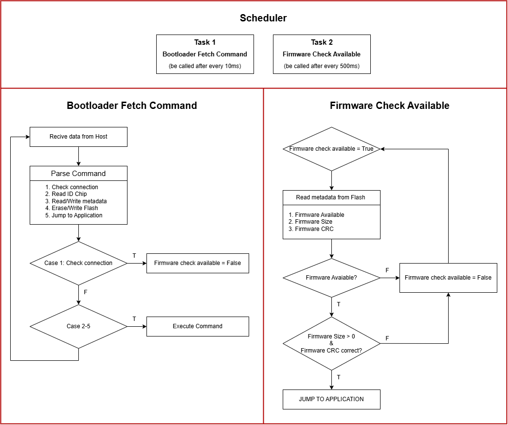

# STM32 Bootloader for FOTA

## Overview
The bootloader is a firmware component running on STM32 microcontrollers (STM32F4, STM32F7, STM32H7) to facilitate **Firmware Over-The-Air (FOTA)** updates via UART. It handles communication with Host Device, handles communication and firmware updates.

## Block Diagram
The following diagram illustrates the processing of the Bootloader program:

  

## Features
- **Supported MCUs**: single-core (STM32F407VGTx, STM32F7VGTx), dual-core (STM32H745ZIT3).
- **UART Communication**: 115200 baudrate.
- **Commands**:
  - Read Chip ID (`0x10`).
  - Jump to Application (`0x12`).
  - Erase Flash (`0x13`).
  - Write Firmware (`0x14`).
  - Check Connection (`0x15`).
  - Read Firmware Version (`0x16`).
  - Write Firmware Version (`0x17`).
- **Memory Management**:
  - Dual-bank support for STM32H745ZITx (Firmware 1: Bank 1, Firmware 2: Bank 2).
  - Metadata storage for firmware version, size, and CRC.
- **CRC32 Verification**: Ensures data integrity for received packets and stored firmware.
- **Timeout Mechanism**: Jumps to the application after 10 seconds (`BL_TIMEOUT`) if no host command is received.

## Memory Map
The bootloader uses a memory layout specific to each MCU type, specifically:
- **For STM32F407VGTx**:
  - `0x08000000`: Bootloader (Sector 0, 128 KB).
  - `0x08020000`: Metadata for Firmware (Sector 1, 128 KB).
  - `0x08040000`: Firmware (Sectors 2-5, 512 KB).
- **For STM32F765VGTx**:
  - `0x08000000`: Bootloader (Sector 0, 128 KB).
  - `0x08020000`: Metadata for Firmware (Sector 1, 128 KB).
  - `0x08040000`: Firmware (Sectors 2-5, 512 KB).
- **For STM32F407VGTx**:
  - **Bank 1**:
    - `0x08000000`: Bootloader (Sector 0, 128 KB).
    - `0x08020000`: Metadata for Firmware 1 (Sector 1, 128 KB).
    - `0x08040000`: Firmware 1 (Sectors 2-5, 512 KB).
  - **Bank 2**:
    - `0x08100000`: Bootloader (Sector 0, 128 KB).
    - `0x08120000`: Metadata for Firmware 2 (Sector 1, 128 KB).
    - `0x08140000`: Firmware 2 (Sectors 2-5, 512 KB).

## Implementation Details
- **Command Protocol**:
  - Packets: `[Length (1 byte)] [Command (1 byte)] [Data] [CRC32 (4 bytes)]`.
  - CRC32 verification using hardware CRC peripheral.
- **Flash Operations**:
  - Stores metadata (availability, address, length, CRC, version) in a dedicated sector.
- **Timeout Mechanism**:
  - After 10 seconds (`BL_TIMEOUT = 10000` ticks), checks for valid firmware.
  - Jump to the application if the firmware is valid. For dual-core systems, both firmwares must be valid.
- **For Dual-Core Support**:
  - Cortex-M7 handles bootloader operations and UART communication.
  - Cortex-M4 waits for M7 initialization via HSEM and jumps to its application.

## Notes

## Limitations
- Assumes a fixed memory layout, which may need adjustment for different STM32 models.
