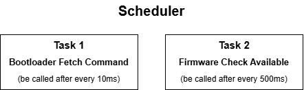
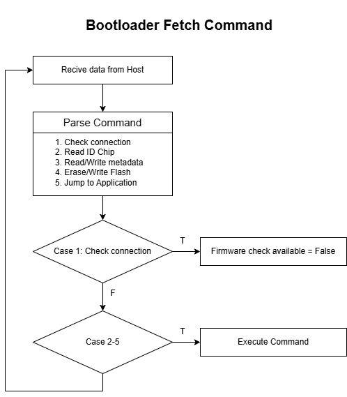
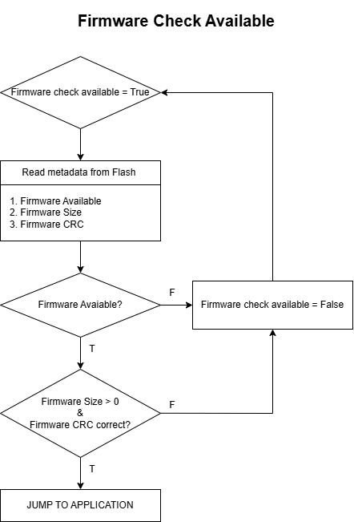

# STM32 Bootloader for FOTA

## Overview
The bootloader is a firmware component running on STM32 microcontrollers (STM32F4, STM32F7, STM32H7) to facilitate **Firmware Over-The-Air (FOTA)** updates via UART. It handles communication with Host Device, handles communication and firmware updates.

## Block Diagram
The following diagram illustrates the interaction between the host and the STM32 MCU:

  
  

    
    

    
  

  

## Features
- **Supported MCUs**: single-core (STM32F407VGTx, STM32F7VGTx), dual-core (STM32H745ZIT3).
- **UART Communication**: 115200 baudrate.
- **Commands**:
  - Read Chip ID (`0x10`).
  - Jump to Application (`0x12`).
  - Erase Flash (`0x13`).
  - Write Firmware (`0x14`).
  - Check Connection (`0x15`).
  - Read Firmware Version (`0x16`).
  - Write Firmware Version (`0x17`).
- **Memory Management**:
  - Dual-bank support for STM32H7 (Firmware 1: Bank 1, Firmware 2: Bank 2).
  - Metadata storage for firmware version, size, and CRC.
- **CRC32 Verification**: Ensures data integrity for received packets and stored firmware.
- **Timeout Mechanism**: Jumps to the application after 10 seconds (`BL_TIMEOUT`) if no host command is received.
- **Scheduler**: Manages periodic tasks (e.g., checking UART commands, monitoring timeout).

## Requirements
- **Hardware**:
  - STM32 development board (STM32F4, STM32F7, or STM32H7).
  - UART interface (TX: PA2, RX: PD6 for STM32H7).
- **Software**:
  - STM32CubeIDE for compilation.
  - STM32CubeProgrammer for flashing.
- **Dependencies**:
  - STM32 HAL library.
  - Custom UART driver (`uart.c`).

## Code Structure
The bootloader is implemented across several files:

- **bootloader.c / bootloader.h**:
  - Core bootloader logic, including command handling and flash operations.
  - Key functions:
    - `BL_UART_Fetch_Host_Command()`: Processes incoming UART commands.
    - `Bootloader_Check_Available()`: Checks for valid firmware and jumps to it after timeout.
    - `Bootloader_Get_Chip_Identification_Number()`: Reads MCU chip ID.
    - `Bootloader_Erase_Flash()`: Erases specified flash bank.
    - `Bootloader_Memory_Write()`: Writes firmware chunks to flash.
    - `Bootloader_Jump_To_User_App()`: Jumps to the application.
    - `Set_Firmware_Version()` / `Get_Firmware_Version()`: Manages firmware metadata.
    - `Flash_Write_Metadata()` / `Flash_Read_Metadata()`: Stores/retrieves firmware metadata.
- **scheduler.c / scheduler.h**:
  - Simple task scheduler for periodic execution of bootloader tasks.
  - Key functions:
    - `SchedulerInit()`: Configures SysTick for 1ms ticks.
    - `SchedulerRun()`: Executes scheduled tasks.
    - `SchedulerSysTickIntHandler()`: Updates tick count and timeout.
- **main_m7.c**:
  - Main entry point for Cortex-M7.
  - Initializes peripherals (UART, CRC, GPIO) and scheduler.
  - Runs the scheduler in an infinite loop.
- **main_m4.c**:
  - Main entry point for Cortex-M4 (STM32H7 only).
  - Uses HSEM to synchronize with Cortex-M7 and jumps to the application.
- **uart.c** (not provided):
  - Handles low-level UART communication (assumed to implement a ring buffer for RX/TX).

## Memory Map
The bootloader uses a specific memory layout for STM32H7 (adaptable for F4/F7):

- **Bank 1**:
  - `0x08000000`: Bootloader (Sector 0, 128 KB).
  - `0x08020000`: Metadata for Firmware 1 (Sector 1, 128 KB).
  - `0x08040000`: Firmware 1 (Sectors 2-5, 512 KB).
- **Bank 2** (STM32H7 only):
  - `0x08100000`: Bootloader (Sector 0, 128 KB).
  - `0x08120000`: Metadata for Firmware 2 (Sector 1, 128 KB).
  - `0x08140000`: Firmware 2 (Sectors 2-5, 512 KB).

## Implementation Details
- **Command Protocol**:
  - Packets: `[Length (1 byte)] [Command (1 byte)] [Data] [CRC32 (4 bytes)]`.
  - CRC32 verification using hardware CRC peripheral.
- **Flash Operations**:
  - Erases 4 sectors per firmware bank (512 KB total).
  - Writes firmware in 32-byte aligned chunks (256-bit flash word).
  - Stores metadata (availability, address, length, CRC, version) in a dedicated sector.
- **Timeout Mechanism**:
  - After 10 seconds (`BL_TIMEOUT = 10000` ticks), checks for valid firmware.
  - Jumps to Firmware 1 if both firmwares are valid (for H7).
- **Dual-Core Support**:
  - Cortex-M7 handles bootloader operations and UART communication.
  - Cortex-M4 waits for M7 initialization via HSEM and jumps to its application.

## Compilation and Flashing
1. **Setup STM32CubeIDE**:
   - Create a project for STM32H7 (or F4/F7).
   - Include `bootloader.c`, `scheduler.c`, `main_m7.c`, `main_m4.c`, and `uart.c`.
2. **Configure**:
   - Set UART pins (PA2: TX, PD6: RX).
   - Enable CRC peripheral.
   - Define memory map in `bootloader.h`.
3. **Compile and Flash**:
   - Build the project.
   - Flash using STM32CubeProgrammer to `0x08000000` (Bank 1) and `0x08100000` (Bank 2 for H7).

## Notes
- The bootloader assumes the application is located at `FIRMWARE_BANK1_BASE` or `FIRMWARE_BANK2_BASE`.
- Firmware metadata is stored in a 256-byte structure, including version, size, and CRC.
- The scheduler runs two tasks: UART command processing (every 10ms) and timeout checking (every 500ms).

## Limitations
- No support for encrypted firmware.
- Limited to UART communication.
- Assumes a fixed memory layout, which may need adjustment for different STM32 models.

For details on the Python host and application development, refer to `README_HOST.md` and `README_APPLICATION.md`.